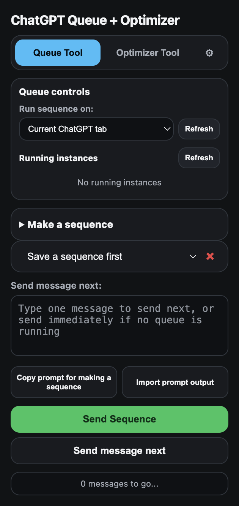

# ChatGPT Queue Optimizer

Browser extension for ChatGPT prompt queues and optimization controls.



The whole thing lives in one popup: queue controls, the sequence builder, and the optimizer.

## What it is

This extension adds queue and prompt-chain tools on ChatGPT so repeated prompt work can run with less babysitting.

## Start here

- `Installers/` - one-click Windows and macOS installers
- `manifest.json` - extension manifest
- `content.js` - ChatGPT page integration
- `popup.html` and `popup.js` - popup controls
- `options.html` - extension settings

## Install

Windows:

```bat
Installers\Install ChatGPT Queue Optimizer.bat
```

macOS:

```bash
open "Installers/Install ChatGPT Queue Optimizer.app"
```

## Notes

The installer targets Google Chrome and Firefox. Chrome can be registered as a packaged extension. Firefox release builds may block unsigned permanent installs, so the installer falls back to a `web-ext` loader when needed.
